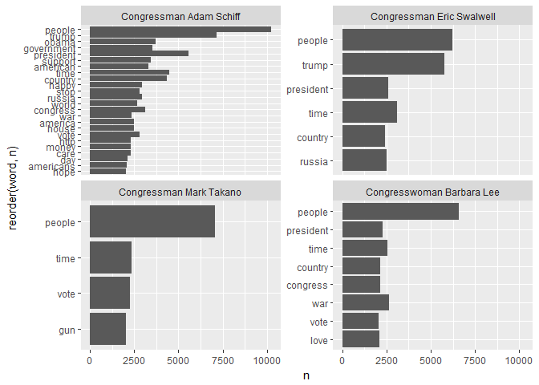
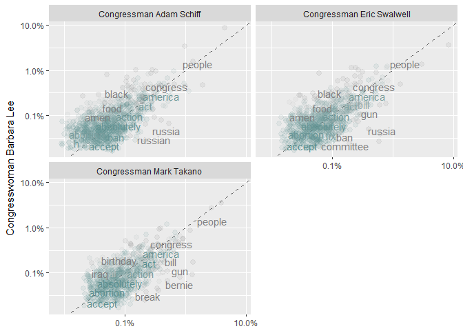
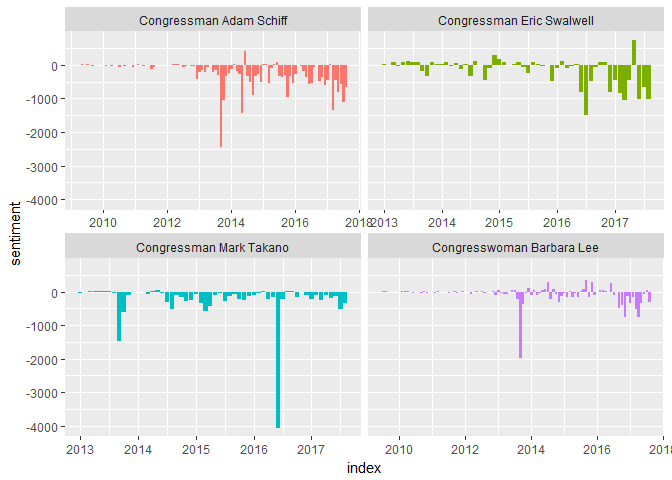
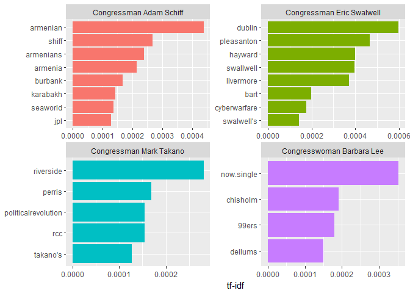
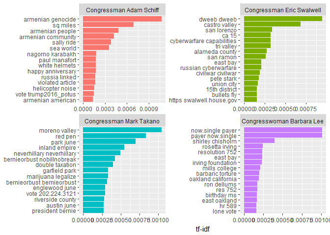
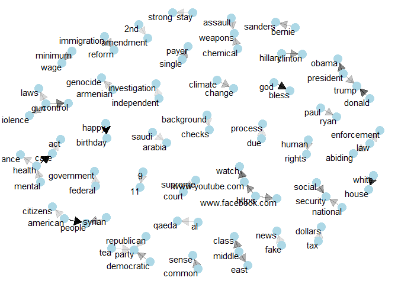
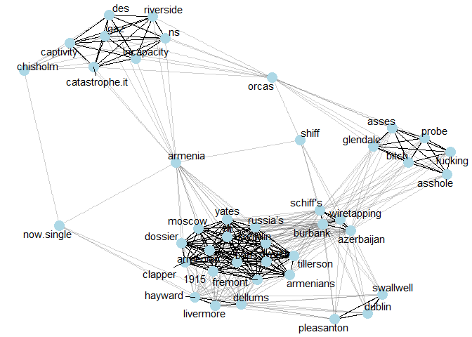

# D4D_JustPoli_FB

# Example of EDA for FB Data

## Background of Data
Most of what's shown here is just a subset of what's currently being collected. We have both page information from candidate's Facebook as well as comments posted on those respective pages. As of 09/04/17 most of comment data is the state of California, so I will be focusing on that state only. Additionally to keep this at a high level, I'm focusing on the top 4 pages (by number of comments) for easier visualization.

Most of the analysis steps taken in this doc are based on several chapters of [Text Mining with R](http://tidytextmining.com/).

## Main Goals of Analysis

- Get a sense of the content within messages
- Rough outline of some basic data prep/cleaning steps
- Basic information on word counts for pages
- Basic sentiment of word usage over time by pages
- Word pair usage (ngram) by page


## Data prep

I'm working with some basic text files that I have already pulled down from the database. Additional steps taken to merge pages and comment data are mentioned at the end of the document.

Here we load the data file containing the California comments with respective page information. The primary focus is on the name which is used to identify the page and ideally the candidate the comments are related too.

### Setup

Read in data, count the top 4 pages, and build custom stop words.  Many of comments contain things like the candidate's name or their title (congressman/woman). We will add these to a custom list of stop words that we will filter out after we tokenize the comments. We do this by using the page name as a list of stop words which should remove most of the names and titles.


```r
#look at pages with most comments
comments.summary
```

```
## # A tibble: 82 x 2
##                           name     n
##                          <chr> <int>
##  1     Congressman Adam Schiff 83213
##  2   Congresswoman Barbara Lee 62322
##  3   Congressman Eric Swalwell 60865
##  4     Congressman Mark Takano 60723
##  5 Congresswoman Jackie Speier 47338
##  6        Congressman Ami Bera 37060
##  7   Congressmember Karen Bass 28325
##  8  Congressman John Garamendi 28247
##  9   Congressman Raul Ruiz, MD 24667
## 10  La Jornada Baja California 19580
## # ... with 72 more rows
```

## Word Level Analysis

### Tokenize Words

We tokenize by word and remove common stop words (the,a,...) We also filter out the custom stop words to remove names and titles based on the page name.

```r
#remove stop words
com_words <- comments %>%
  unnest_tokens(word, message) %>%
  anti_join(stop_words, by= "word")

#filter out common names and titles
com_words <- anti_join(com_words, mystopwords, by = "word")

#filter by top 4 pages
com_words <- com_words %>%   filter(name %in% top_4_pages$name)

#show top words
com_words %>% count(word, sort=TRUE)
```

```
## # A tibble: 100,142 x 2
##          word     n
##         <chr> <int>
##  1     people 30119
##  2      trump 15357
##  3       time 12493
##  4  president 12025
##  5    country 10718
##  6 government  8693
##  7    support  8693
##  8   congress  8658
##  9       vote  8614
## 10      obama  8186
## # ... with 100,132 more rows
```

### Comparing word count by page name

Grouping by page name we look at the top words to compare what words are most common by page(candidate).


```r
#seems to show better results with removal of names, may need some tweaking (remove people?)
com_words %>%  group_by(name) %>%
  count(word, sort = TRUE) %>% filter(n >= 2000) %>% group_by(name) %>% mutate("proportion" = n /
  sum(n)) %>% ggplot(aes(y = n, x = reorder(word, n))) + geom_bar(stat = "identity") +
  facet_wrap( ~ name, scales = "free_y") + coord_flip()
```

<!-- -->


### Plot word Freq

An interesting way to compare to candidate's frequency of word usage. Points close to the line indicate they use the same word with about the same frequency. Points further away from the line indicate that one candidate uses the word more often than the other. For example, people who posted on Eric's page were more likely to mention Trump, Russia, or Russian compared to people who posted on Barbara's page.

Here we use Barbara as the Y-axis and compare frequency of word usage to the rest of the candidates.

```r
#plot to compare similarity of words between 2 candidates
com_words  %>% mutate(word = stringr::str_extract(word, "[a-z']+"))  %>% group_by(name, word) %>%
summarise(n = n()) %>% filter(n >= 100)  %>% group_by(name) %>% mutate("proportion" = n /
sum(n)) %>% select(-n) %>% spread(name, proportion) %>% gather(name,
proportion,
`Congressman Adam Schiff`:`Congressman Mark Takano`) %>% ggplot(aes(
x = proportion,
y = `Congresswoman Barbara Lee`,
color = abs(`Congresswoman Barbara Lee` - proportion)
)) +
geom_abline(color = "gray40", lty = 2) +
geom_jitter(
alpha = 0.1,
size = 2.5,
width = 0.3,
height = 0.3
) +
geom_text(aes(label = word), check_overlap = TRUE, vjust = 1.5) +
scale_x_log10(labels = percent_format()) +
scale_y_log10(labels = percent_format()) +
scale_color_gradient(limits = c(0, 0.001),
low = "darkslategray4",
high = "gray75") +
facet_wrap( ~ name, ncol = 2) +
theme(legend.position = "none") +
labs(y = "Congresswoman Barbara Lee", x = NULL)
```

```
## Warning: Removed 3251 rows containing missing values (geom_point).
```

```
## Warning: Removed 3254 rows containing missing values (geom_text).
```

<!-- -->

### Plot Sentiment using words

Visualize sentiment of word content of posts over time. Group by month of post and calculate sentiment of word.

Large swings in sentiment or long patterns of negative sentiment may be useful for identifying trouble for candidate. 

```r
#add date (yyyy-mm-dd) an month to group by for sentiment
com_words <-
com_words %>% mutate(
"Post_Day" = as.Date(created_at.x),
"Post_Month" = zoo::as.yearmon(Post_Day)
)

#sentiment plot by Post_month
com_words %>% mutate(word = stringr::str_extract(word, "[a-z']+")) %>%
inner_join(get_sentiments("bing")) %>%
count(name, index = Post_Month, sentiment) %>%
spread(sentiment, n, fill = 0) %>%
mutate(sentiment = positive - negative) %>% ggplot(aes(index, sentiment, fill =
name)) + geom_col(show.legend = FALSE) + facet_wrap( ~ name, ncol = 2, scales =
"free_x")
```

```
## Joining, by = "word"
```

```
## Don't know how to automatically pick scale for object of type yearmon. Defaulting to continuous.
```

<!-- -->

### Word and Document Freq (TF_IDF)

Here we calculate the term frequency and inverse frequency to measure how important a word is to a page. The TF_IDF tries to find sweet spot between words that are used often (high TF) versus words that not commonly found in other pages (high TF/rare).


```r
#looking at tf_idf
com_words_tfidf <- com_words %>%  count(name, word, sort = TRUE) %>%
  ungroup() %>%  bind_tf_idf(word,name,n)


com_words_tfidf %>%arrange(desc(tf_idf))
```

```
## # A tibble: 176,889 x 6
##                         name       word     n           tf       idf
##                        <chr>      <chr> <int>        <dbl>     <dbl>
##  1 Congressman Eric Swalwell     dublin   277 0.0004319607 1.3862944
##  2 Congressman Eric Swalwell pleasanton   216 0.0003368358 1.3862944
##  3   Congressman Adam Schiff   armenian  1458 0.0015259394 0.2876821
##  4 Congressman Eric Swalwell    hayward   369 0.0005754278 0.6931472
##  5 Congressman Eric Swalwell  swallwell   183 0.0002853748 1.3862944
##  6 Congressman Eric Swalwell  livermore   344 0.0005364422 0.6931472
##  7 Congresswoman Barbara Lee now.single   138 0.0002547733 1.3862944
##  8   Congressman Mark Takano  riverside   448 0.0009779097 0.2876821
##  9   Congressman Adam Schiff      shiff   185 0.0001936206 1.3862944
## 10   Congressman Adam Schiff  armenians   795 0.0008320451 0.2876821
## # ... with 176,879 more rows, and 1 more variables: tf_idf <dbl>
```

### Top words based on TF_IDF by Page 
Ideally this plot give a basic way to tell what words distinguish words on one candidate's page from the rest.


```r
plot_tf <- com_words_tfidf %>%
  arrange(desc(tf_idf)) %>% 
  mutate(word = factor(word, levels = rev(unique(word))))

plot_tf %>% 
  top_n(25) %>%
  ggplot(aes(word, tf_idf, fill = name)) +
  geom_col(show.legend = FALSE)+
  labs(x = NULL, y = "tf-idf") +facet_wrap(~name, ncol = 2, scales = "free")+
  coord_flip()
```

```
## Selecting by tf_idf
```

<!-- -->

## N-grams

Now we will switch to looking at pairs of words. We go through a similar process of removing stop words and calculating the TF_IDF for word pairs and then visualize by page name.


### Data Prep - N-grams


```r
#calculate n-grams for word pairs (n = 2) and filter out stop words
com_ngram_sep <-
  comments %>% unnest_tokens(ngram, message, token = "ngrams", n = 2) %>%  separate(ngram, c("word1", "word2"), sep = " ") %>% filter(!word1 %in% stop_words$word) %>%
  filter(!word2 %in% stop_words$word)

#filter out manual stop words
com_ngram_sep <-
  com_ngram_sep %>% filter(!word1 %in% mystopwords$word) %>%
  filter(!word2 %in% mystopwords$word)

#combine back together to caclulate tf_idf
com_ngram <- com_ngram_sep %>% unite(ngram, word1, word2, sep = " ")

#calculate tf_idf
com_ngram_tfidf <- com_ngram %>% count(name, ngram) %>%
  bind_tf_idf(ngram, name, n) %>%
  arrange(desc(tf_idf))
```

## Plot by Page 

```r
#plot top ngrams by name
com_ngram_tfidf %>%  arrange(desc(tf_idf)) %>%   mutate(ngram = factor(ngram, levels = rev(unique(ngram)))) %>% group_by(name) %>%
top_n(15) %>%
ungroup %>%  ggplot(aes(ngram, tf_idf, fill = name)) +
geom_col(show.legend = FALSE) +
labs(x = NULL, y = "tf-idf") +
facet_wrap(~ name, ncol = 2, scales = "free") +
coord_flip()
```

```
## Selecting by tf_idf
```

<!-- -->


## Visualize network graph of ngrams

Network graph of words pairs showing the strength of the word pair by number of occurrences.

```r
#count word pairs to create network graph
bigram_counts <-
com_ngram_sep  %>%  count(word1, word2, sort = TRUE)

#filter by min num counts and convert to graph form
bigram_graph <- bigram_counts %>%
filter(n > 400) %>%
graph_from_data_frame()


set.seed(999)

#format arrow for graph
a <- grid::arrow(type = "closed", length = unit(.15, "inches"))

#network graph of ngrams - strength of edge based on num of occurences
ggraph(bigram_graph, layout = "fr") +
geom_edge_link(
aes(edge_alpha = n),
show.legend = FALSE,
arrow = a,
end_cap = circle(.07, 'inches')
) +
geom_node_point(color = "lightblue", size = 5) +
geom_node_text(aes(label = name), vjust = 1, hjust = 1) +
theme_void()
```

<!-- -->


## Correlation of words within Page Name

Now instead of looking at adjacent words we look at another network graph to look at the pairwise correlation between words within a candidate's page. Here we can see some interesting network connections based on the correlation strength between words.


```r
library(widyr)


#find pairwise correlation for words within page name
word_cors <- com_words %>%
group_by(word) %>%
filter(n() >= 100) %>%
pairwise_cor(word, name, sort = TRUE)


word_cors %>%
filter(correlation > .50) %>%
graph_from_data_frame() %>%
ggraph(layout = "fr") +
geom_edge_link(aes(edge_alpha = correlation), show.legend = FALSE) +
geom_node_point(color = "lightblue", size = 5) +
geom_node_text(aes(label = name), repel = TRUE) +
theme_void()
```

<!-- -->

## Next Step/Thoughts

This was meant to be a very high level overview of some the data already collected. Hopefully this provides some useful information that  can be used for other districts/states and hopefully give some early indications of useful words/word pairs for feature extraction.

## Misc pre-analysis steps


```r
#pulled from database (all states)
comments <- read_csv("commentsfull.csv")

#pulled from database contains most of the important name,state,county data
pages <- read_csv("pagesfull.csv")

#duplicate page id's filter out until we know why?
pages <- pages %>% distinct(page_id,.keep_all=TRUE)

#merge by page id (contains info on candidates)
comments <- left_join(comments,pages, by="page_id")


#filter to just cali
comments <- comments %>% filter(state=="California")


save(comments,file="commentsfull.RData")
```

